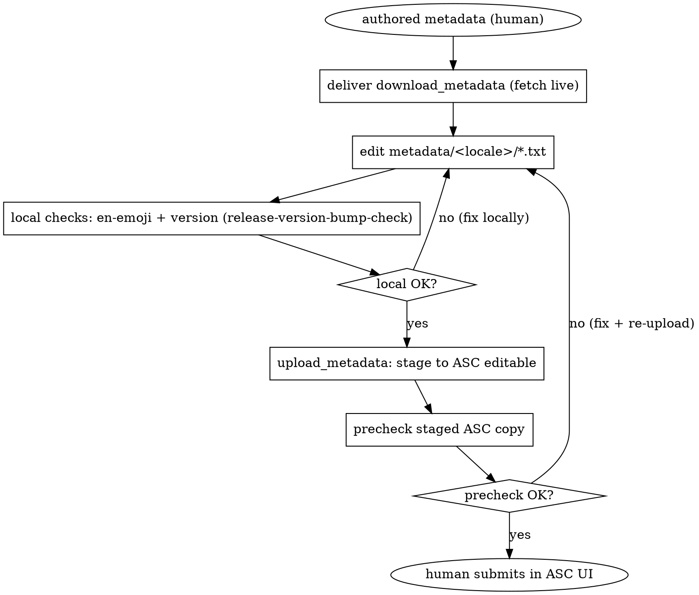

# ASC Metadata Delivery

## Overview

「ASC の申請メタデータ入力を自動化する」は、実質「`fastlane/metadata/` 配下の txt 群を整備し、ワンコマンドで投入する」ことに分解できる。fastlane `deliver`（= `upload_to_app_store`）が scaffold・投入・検証を全部持っているため、このスキルが新規に足す価値は次の狭い3点に絞られる:

1. Xcode Cloud 共存レシピ — バイナリは Xcode Cloud が所有したまま、メタデータだけを push する (`skip_binary_upload: true`)。
2. 複数アプリ再利用 — スキル本体は 100% app 非依存。実行 repo の `Appfile` / `metadata/` / locale を読むだけで、アプリ固有値をスキルに埋め込まない。
3. 検証の合成 — `precheck`（ASC 側 staged コピーを検証）と、`precheck` が拾わない穴（英語ロケールの emoji 拒否・version bump）を `release-version-bump-check`（ローカルで検証可能）に委譲して合成する。

スコープ外: 文章生成 / コピーライティング、スクリーンショット画像の生成（パス配線のみ対象）、バイナリのビルド・アップロード（Xcode Cloud 所有）、ASC 認証情報のセットアップ（各 repo の `SETUP.md` / `.env` 所有）。

## When to Use

- 既存 / 新規 iOS アプリの ASC リスティング（name / subtitle / description / keywords / release notes など）を更新・投入したい。
- バイナリは別系統（Xcode Cloud / 手動 Archive）で上げており、メタデータだけを push したい。
- 複数アプリで同じ投入フローを使い回したい。

Don't use when:

- バイナリ（ipa）のビルド・アップロードが目的（それは Xcode Cloud / `build_app` + `upload_to_testflight` の領分）。
- メタデータの文章そのものを書く作業（このスキルは執筆済み txt を入力に取る）。

## Safety: deliver は本番 ASC に書き込む

`upload_to_app_store` は `skip_binary_upload:true` / `submit_for_review:false` でも、metadata を live の ASC バージョンに stage（書き込み）する。`submit_for_review:false` は「審査に submit しない」だけで「ASC に書かない」ではない。よって:

- 投入系コマンド（`deliver download_metadata` 以外）は必ず人間が認証情報付きで手実行。CI / subagent では自動実行しない。
- 順序は download → edit → ローカル検証 → upload(stage) → precheck → 人間が submit。`download_metadata` を先に走らせ live 内容を取得してから編集する（placeholder を上書き投入して live を壊さない）。

## precheck はローカルではなく ASC 側を見る (重要な実測事実)

`fastlane precheck` は `check_app_store_metadata` のエイリアスで、オプションは 主に `api_key` / `api_key_path` / `username` / `app_identifier` / `team_id` / `use_live` 等 。**ローカルファイルを指す `metadata_path` は無い** = precheck は **ASC 側の編集中(editable)メタデータ**を取得して検証する（`use_live:true` で公開中バージョンに切替）。

含意:

- precheck は「これから push する**ローカルの新コピー**」をローカルでは検証できない。検証するには **先に upload で ASC の editable へ stage し、その後 precheck で staged コピーを見る**。よって lane は **upload → precheck の順**。
- stage-only（`submit_for_review:false`）なので、precheck が staged コピーで違反を出しても、まだ審査には出ていない。修正して再 upload すれば良い。precheck は「人間が ASC UI で submit する前の最後の門」。
- ローカルで事前に潰せる穴（en-emoji・version bump）は upload 前に `release-version-bump-check` で潰す（後述）。

## Core Workflow



## 共存の核心 (最重要)

1. Xcode Cloud がバイナリを ASC に upload・処理（既存・不変）。
2. このスキルの lane が metadata-only を push（`skip_binary_upload: true`）。必要なら `build_number` で Xcode Cloud がアップした特定ビルドを添付。
3. 審査提出は別の意図的なステップ。既定は `submit_for_review: false`（ステージのみ）で、提出は ASC UI で人間が行う。自動提出は `submit_for_review: true` に明示 opt-in した時だけ。

狙い: メタデータ push がデフォルトで審査を誤発火しないこと。Xcode Cloud（バイナリ）と deliver（メタデータ）の所有境界を分け、衝突せず共存させる。

## 全アプリ共通の薄い lane (upload → precheck)

各 repo の `fastlane/Fastfile` に置く（コピー、または共有スニペットに factor out）:

```ruby
lane :upload_metadata do
  # 先に metadata を ASC の editable に stage する (skip_binary_upload で binary は触らない)。
  # force は付けない: この lane は人間が手実行する前提なので、本番書き込み前に
  # deliver の HTML プレビューを人間が確認する gate を意図的に残す。
  upload_to_app_store(
    skip_binary_upload: true,   # バイナリは Xcode Cloud 所有
    submit_for_review: false    # ステージのみ。提出は意図的な別操作
  )
  # precheck はローカルではなく ASC 側 (editable) を検証する (metadata_path オプション無し)。
  # よって upload の後に呼び、いま stage したコピーを人間 submit 前に検証する。
  precheck
end
```

注意: deliver の `run_precheck_before_submit` は submit フロー前提で、推奨デフォルトの stage-only では発火しない。precheck を明示ステップで呼ぶことでこの穴を塞ぐ。precheck は ASC 認証必須（`--username` / `--api_key`）で、stage 済みの editable バージョンをチェックする。

## 検証の合成 (precheck の穴を埋める)

| 観点 | 担い手 | データ源 |
| --- | --- | --- |
| placeholder / curse / future-functionality / unreachable URL 等 | `fastlane precheck`（ASC 認証必須） | ASC 側 staged(editable) コピー（upload 後） |
| `MARKETING_VERSION` / `CURRENT_PROJECT_VERSION` の bump（ITMS-90186 / 90062 / 90478） | `release-version-bump-check` | ローカル `project.pbxproj`（upload 前） |
| 英語ロケールの emoji 拒否（en の Description / What's New に絵文字 → ASC が silent fail） | `release-version-bump-check` | ローカル `metadata/en-US/*.txt`（upload 前。precheck は emoji を検出しない） |
| Age Rating "Advertising" = Yes（広告 SDK 統合時） | `release-version-bump-check` | ASC UI（手動） |

precheck は emoji も version bump も検出しない（precheck のルールは placeholder_text / curse_words / unreachable_urls 等）。これらは upload 前にローカルで `release-version-bump-check` 側で潰す（en-emoji と version はローカルファイル / pbxproj を見れば offline で検査できるので、upload して ASC を汚す前に弾けるのが利点）。

## 新アプリ オンボーディング 5 ステップ

スキルはグローバルに 1回 install。per-app の作業はこれだけ（per-app のスキル複製は不要）:

1. `fastlane/Appfile` に `app_identifier` / `team_id` / `itc_team_id` / `apple_id` を設定。
2. 認証情報を `.env`（各 repo の `SETUP.md` 準拠）に設定（`FASTLANE_USER` + App-Specific Password、または ASC API Key）。
3. `fastlane deliver download_metadata` で `metadata/` を live ASC から scaffold（`deliver init` でも可）。
4. 各 locale の txt を執筆して配置（en-US は emoji 禁止・文字数制限を `release-version-bump-check` で確認）。
5. `fastlane upload_metadata` で metadata-only 投入（stage → precheck）→ ASC UI で人間が提出判断。

## metadata ディレクトリ構造

```
metadata/
├── copyright.txt              # 非ローカライズ
├── primary_category.txt       # 非ローカライズ
├── <locale>/                  # 例: en-US, ja
│   ├── name.txt               # 30 文字以内
│   ├── subtitle.txt           # 30 文字以内
│   ├── description.txt
│   ├── keywords.txt           # カンマ区切り 100 文字以内 / en は emoji 禁止
│   ├── release_notes.txt
│   ├── promotional_text.txt
│   ├── support_url.txt
│   ├── marketing_url.txt
│   └── privacy_url.txt
└── review_information/        # demo_user / demo_password は secret。gitignore する
    ├── first_name.txt
    ├── last_name.txt
    ├── email_address.txt
    ├── phone_number.txt
    ├── demo_user.txt
    ├── demo_password.txt
    └── notes.txt
```

`review_information/` は審査用 demo 認証情報など機微情報を含むため各 repo で gitignore する（content の name/subtitle/... は version 管理して良い）。

## Common Mistakes

| Mistake | Symptom | Fix |
| --- | --- | --- |
| precheck を upload の前に置く | 古い ASC コピーを検証し、これから push する新コピーは未検証 | upload → precheck の順（precheck は ASC 側 editable を見る。新コピーは upload 後に存在） |
| precheck に metadata_path を渡してローカル検証しようとする | option 非対応でエラー / 無視 | precheck はローカルを見ない。ローカル検査は `release-version-bump-check`（en-emoji/version）で |
| download せず placeholder を upload | live ASC のメタデータが placeholder で上書き | 必ず `deliver download_metadata` → 編集 → upload の順 |
| `submit_for_review:false` を「ASC に書かない」と誤解 | 意図せず live editable に metadata が stage された | false は submit しないだけ。stage（書き込み）は起きる |
| review_information を commit | demo 認証情報が git に漏洩 | `review_information/` を gitignore、`.gitkeep` のみ commit |
| バイナリも一緒に上げようとする | Xcode Cloud のビルドと衝突 | `skip_binary_upload:true`。バイナリは Xcode Cloud 所有のまま |

## Pairs With

- `release-version-bump-check` — version bump / en-emoji / Age Rating の検証を委譲（upload 前のローカル検査）。
- 各 repo の `fastlane/SETUP.md` — 認証情報セットアップ（このスキルのスコープ外）。
